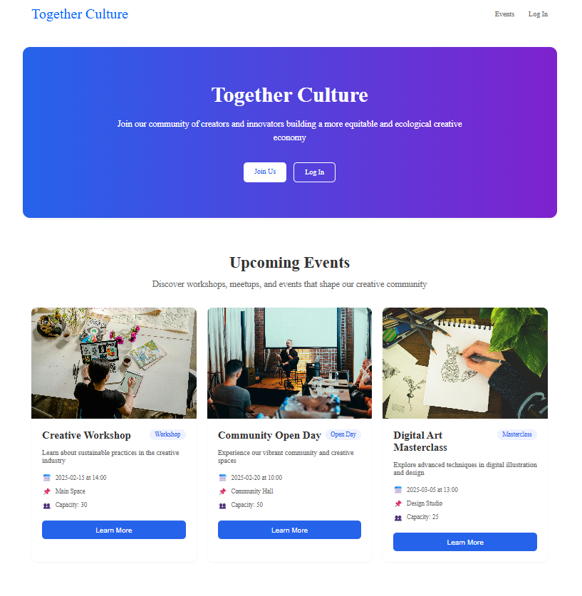
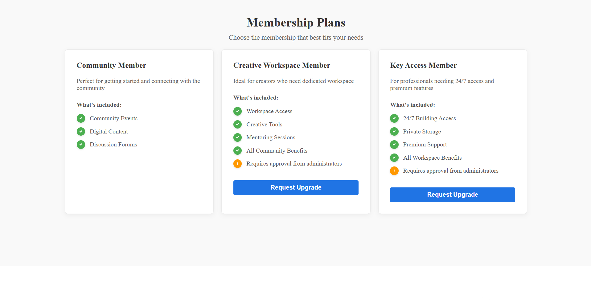
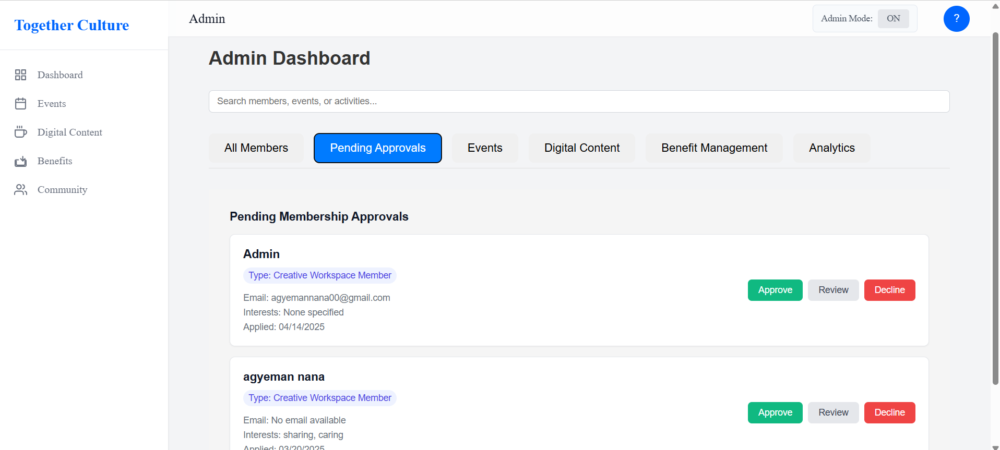
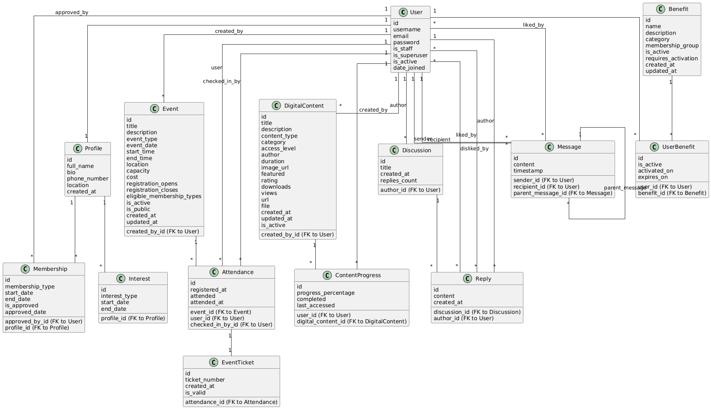

# 🤝 Together Culture CRM

A full-stack **Customer Relationship Management (CRM)** system built for **Together Culture**, designed to help manage members, membership tiers, events, digital content and community engagement in one central platform.

The project was developed as part of the **Advanced Web Solutions** module and focused on replacing manual community management processes with a secure, scalable and user-friendly web application.

---

## 📌 Overview

Together Culture needed a digital platform to support its growing community and improve how it manages members, events, digital resources and membership benefits.

This CRM provides separate experiences for:

- Public visitors
- Registered members
- Administrators

It includes secure authentication, member profiles, role-based access, membership management and admin approval workflows.

---

## ❗ Problem

Together Culture relied on manual and disconnected processes to manage community operations.

This created challenges around:

- Tracking member activity and engagement
- Managing different membership tiers
- Handling membership upgrade requests
- Delivering digital content to members
- Managing events and member participation
- Giving administrators visibility over users and requests
- Supporting future community engagement features

---

## ✅ Solution

The Together Culture CRM provides a central platform for:

- User registration and login
- Secure JWT authentication
- Member profile creation and updates
- Interest tracking
- Membership tier management
- Membership upgrade requests
- Admin approval workflows
- Event and digital content support
- Role-based user and admin dashboards
- Backend validation and automated tests

---

## 🧰 Tech Stack

### Backend

- Python
- Django
- Django REST Framework
- MySQL
- JWT Authentication

### Frontend

- React
- Vite
- JavaScript
- HTML/CSS

### Tools

- GitHub
- Visual Studio Code

---

## 🏗️ Architecture

The application follows a full-stack client-server architecture.

```text
React Frontend
     |
     | REST API Requests
     v
Django REST Framework Backend
     |
     | Django ORM
     v
MySQL Database
```

Authentication is handled using JWT tokens. Users are routed based on their authentication state and role.

```text
Public User
   └── Landing Page / Sign Up / Login

Authenticated Member
   └── User Dashboard / Profile / Events / Content / Membership

Admin User
   └── Admin Dashboard / User Management / Membership Approvals
```

---

## ✨ Main Features

### 🔐 Authentication and Profiles

- User registration
- Login with JWT authentication
- Password reset
- Profile creation and update
- Interest selection and tracking
- Protected member-only routes

### 🧾 Membership Management

- Default community membership assignment
- Membership upgrade requests
- Pending request tracking
- Admin approval and rejection workflow
- Membership lifecycle tracking

### 🛠️ Admin Features

- View pending membership requests
- Approve or reject membership upgrades
- Manage users and member access
- Support role-based access control

### 📊 CRM Features

- Member data management
- Membership tier differentiation
- Event tracking
- Digital content support
- Community engagement foundations

---

## 🧪 Testing

The project included backend unit and end-to-end tests for key workflows.

Tested areas included:

- Successful user registration
- Invalid registration inputs
- Duplicate username and email validation
- Password strength checks
- Profile creation
- Interest validation
- Login and JWT token generation
- Protected route access
- Password reset
- Membership upgrade requests
- Duplicate request prevention
- Admin membership approval
- User cancellation of pending requests

✅ All documented test cases passed successfully.

---

## 📈 Key Results

- Built a bespoke CRM platform tailored to Together Culture’s workflows
- Implemented secure JWT-based authentication
- Developed profile and membership management workflows
- Added role-based access for standard users and administrators
- Created automated tests for authentication, profile and membership features
- Helped deliver a full-stack Django and React CRM as part of a 5-person team
- Improved maintainability by separating frontend, backend and database responsibilities

---

## 🖼️ Screenshots and Diagrams

### 🏠 Landing Page



---

### 📊 Member Dashboard


---

### 👤 Profile Page


---

### 🧾 Membership Request



---

### ✅ Admin Approval



---

### 🗄️ Database Design



---

### 🔄 System Flow


---

## 🚀 How to Run Locally

### 1. Clone the repository

```bash
git clone https://github.com/aws-crm/together-culture-crm.git
cd together-culture-crm
```

---

## ⚙️ Backend Setup

### 2. Create and activate a virtual environment

```bash
python -m venv .venv
source .venv/bin/activate
```

On Windows:

```bash
.venv\Scripts\activate
```

### 3. Install backend dependencies

```bash
cd backend
pip install -r requirements.txt
```

### 4. Create a `.env` file

Create a `.env` file inside the `backend` directory:

```env
SECRET_KEY=your_secret_key
DEBUG=True
```

### 5. Run migrations

```bash
python manage.py migrate
```

### 6. Create a superuser

```bash
python manage.py createsuperuser
```

### 7. Start the backend server

```bash
python manage.py runserver
```

The backend will run on:

```text
http://localhost:8000
```

---

## 💻 Frontend Setup

### 8. Install frontend dependencies

Open a new terminal and run:

```bash
cd frontend
npm install
```

### 9. Create a `.env` file

Create a `.env` file inside the `frontend` directory:

```env
VITE_API_BASE_URL=http://localhost:8000
```

### 10. Start the frontend

```bash
npm run dev
```

The frontend will run on:

```text
http://localhost:5173
```

---

## 📁 Project Structure

```text
together-culture-crm/
├── backend/              # Django backend and REST API
├── frontend/             # React + Vite frontend
├── assets/               # Screenshots and diagrams for README
├── .gitignore
└── README.md
```

---

## 🔮 What I Would Improve Next

Future improvements I would make include:

- Add richer analytics dashboards for member engagement
- Improve admin reporting and data visualisation
- Add automated email notifications for events and membership updates
- Expand community features such as discussions and direct messaging
- Improve mobile responsiveness
- Add more end-to-end frontend tests
- Deploy the application to a cloud platform
- Add CI/CD for automated testing and deployment
- Improve documentation for API endpoints

---
